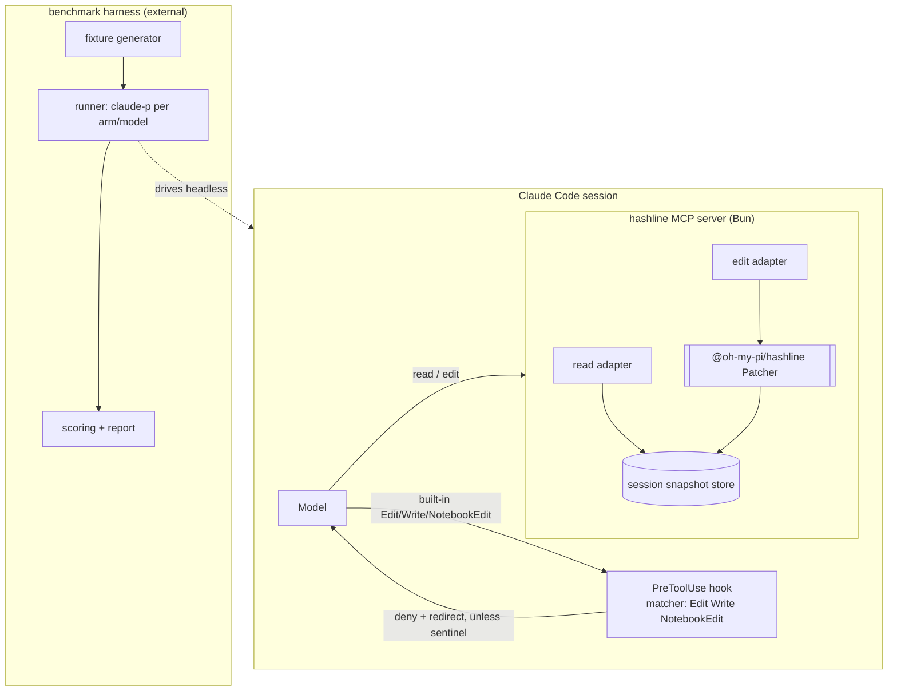
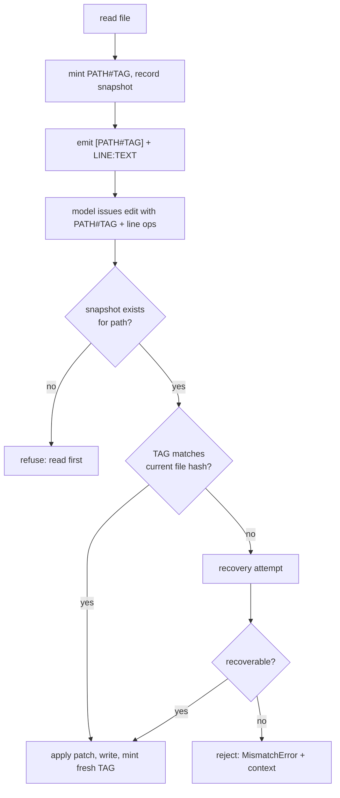

# feat: Hashline edit tool for Claude Code

## Summary

Ship `claude-hashline` as a Claude Code plugin that replaces `str_replace`-style editing with hashline: a Bun MCP server exposing `read` and `edit` tools that wrap the published `@oh-my-pi/hashline` patch engine, plus a PreToolUse hook that blocks the built-in `Edit`/`Write`/`NotebookEdit` tools (with a sentinel escape hatch). A second phase adds a `claude-p` benchmark that measures hashline against the built-in editor across Claude tiers. The plugin phase ships first and is usable on its own.

---

## Problem Frame

The built-in editor anchors edits on the model reproducing exact prior text including whitespace; near-misses are rejected and the model burns turns and context on retry loops. Hashline anchors edits on a whole-file content hash plus bare line numbers, so the model never reproduces old content. The patch language, applier, stale-anchor recovery, and model-facing prompt already exist as a battle-tested MIT package (`@oh-my-pi/hashline`) extracted from the oh-my-pi harness — so the work here is integration into Claude Code's extension points, not reinvention.

---

## High-Level Technical Design

Two subsystems: the **plugin** (an MCP server + a block hook running inside a normal Claude Code session) and the **benchmark** (an external harness that drives headless Claude Code sessions via `claude-p`).

Edit verification path (the stale-read guard, R5/R6):

---

## Key Technical Decisions

- KTD1. Reuse `@oh-my-pi/hashline` (MIT) via npm rather than reimplement. The package ships the patch grammar, tokenizer/parser, applier, snapshot store, and stale-anchor recovery, with only `diff` + `lru-cache` as runtime dependencies — **provided v1 stays on line-range ops** (see KTD4). The package's tree-sitter `block` ops (`replace block N:` etc.) require a separate native dependency (`@oh-my-pi/pi-natives`, a NAPI binary) and are out of scope for v1; including them would falsify the dependency surface. Supply chain: commit `bun.lock`, run `bun audit` against the pinned tree before merge, and verify npm provenance. Vendoring the source (MIT, attribution carried in a `NOTICE` file) is the fallback, triggered by a failed audit, an unsigned package, or a Bun-version conflict.
- KTD2. Expose the tools through an MCP server, not a CLI-over-Bash. The edit patch is a multiline `input` string, which a typed MCP field carries cleanly while a Bash arg would require stdin/temp-file plumbing; a first-class tool also improves tool-selection. Hooks cannot add a tool, and built-in `Read` output cannot be reformatted, so a custom read+edit surface is required regardless.
- KTD3. Run the MCP server under Bun. `@oh-my-pi/hashline` is Bun-native TypeScript shipping source (`main` is `src/index.ts`, `engines.bun >= 1.3.14`); Bun runs a stdio MCP server directly via `bun run`.
- KTD4. Adopt the shipped anchor contract: a whole-file four-uppercase-hex hash in a `[PATH#TAG]` header plus bare line-number ops (`replace N..M:`, `insert before/after N:`, `delete N..M`, `insert head/tail:`). This supersedes the brainstorm's per-line `line:hash` wording — the plan's R1 and AE1 reflect this decided contract, not the brainstorm's `12:a3` notation. The package's `prompt.md` is the starting point for the `edit` tool description but is **adapted, not reused verbatim**: strip the tree-sitter `block` op sections (excluded per KTD1) and the "use the write tool to create new files" line (the adapter handles creation itself per KTD10, since built-in `Write` is blocked). Otherwise preserve the package's patch-language contract.
- KTD9. Contain every edit path to the session workspace root. The `edit` tool resolves each `[PATH#TAG]` header to an absolute path and rejects it before calling the `Patcher` if it escapes the allowed root (cwd, or a configured workspace root). The patch `input` is model-controlled and can be prompt-injected, so path containment is a hard gate, not advisory — without it the tool is an arbitrary-file-write primitive.
- KTD10. The `edit` adapter creates new files itself. The package patcher throws on a missing file and steers to a `write` tool, but built-in `Write` is blocked — so the adapter detects a missing-path full-content section, creates it via `NodeFilesystem` inside the containment root, then proceeds. This is what makes `edit` a true superset of `Write` (R4).
- KTD5. Hold the snapshot store and read-tracking in the MCP server process (session-scoped, in-memory) using the package's snapshots module. The server sees both `read` and `edit` calls; the hook (a separate per-call process) cannot, so read-before-edit and stale detection must live server-side.
- KTD6. Block built-ins with a PreToolUse hook matching `Edit|Write|NotebookEdit`, returning `permissionDecision: "deny"` with a reason that names the hashline `edit` tool. The escape hatch is a runtime sentinel the hook checks — `HASHLINE_DISABLED` env var or a `.hashline-off` file in cwd — since `hooks.json` is static and there is no plugin-level tool-disable. Built-in `Read`/`Grep` stay available for non-text cases.
- KTD7. Toggle benchmark arms with `claude-p --disallowedTools`, not the hook: the hashline arm disallows `Edit Write NotebookEdit`; the control arm disallows `mcp__plugin_claude-hashline_hashline__*`. No reinstall between arms; the hook remains the daily-use mechanism.
- KTD8. Fixtures are reversible mechanical mutations of real source files; pass/fail is the post-edit file matching the pre-mutation original after formatting. The inverse mutation is the ground-truth fix.

---

## Requirements

Carried from the origin brainstorm (`origin:` above), grouped by concern.

### Hashline tools

- R1. The `read` tool returns each line tagged under a `[PATH#TAG]` header as `LINE:TEXT`.
- R2. A `grep`/`search` tool returns matches with the same tagging. (Deferred — not in v1; see Scope Boundaries.)
- R3. The `edit` tool applies edits by line-anchored ops: replace-range, insert before/after, insert head/tail, delete-range.
- R4. The `edit` tool also creates a new file and does full-content replacement, so it is a strict superset of the blocked `Write` (the adapter creates missing files directly per KTD10; the package patcher alone refuses them).
- R5. An edit whose `[PATH#TAG]` does not match the current file is recovered if possible, else rejected without modifying the file.
- R6. An edit to a file with no snapshot recorded this session is refused with an instruction to read it first.

### Block and escape

- R7. When enabled, a PreToolUse hook denies built-in `Edit`, `Write`, and `NotebookEdit`, returning a message that redirects to the hashline `edit` tool.
- R8. Built-in `Read`/`Grep` stay available for non-text cases; the model is steered toward the hashline `read` tool for text reads. No hashline grep in v1 — grep falls back to built-in, after which the model must `read` before editing.
- R9. A runtime sentinel disables the block without uninstalling the plugin.

### Benchmark

- R10. Fixtures are generated by mutating real source files with reversible mechanical bugs, each paired with a plain-English task description.
- R11. The harness runs each task headless in an isolated workspace via `claude-p`, on a temporary copy of the file.
- R12. Two arms run per task: hashline (built-in editors disallowed) and control (hashline tools disallowed).
- R13. Each arm runs across multiple Claude tiers.
- R14. Each run captures edit-failure/rejection count, output tokens, and pass/fail (post-edit file vs. expected after formatting).
- R15. The harness emits a comparison report broken down by model and arm.

---

## Implementation Units

### Phase 1 — Plugin (daily-value deliverable)

### U1. MCP server bootstrap

- Goal: a Bun stdio MCP server named `hashline` registered with the plugin, depending on `@oh-my-pi/hashline`.
- Requirements: R1, R3 (foundation).
- Dependencies: none.
- Files: `package.json`, `tsconfig.json`, `src/server.ts`, `.mcp.json`, `.claude-plugin/plugin.json` (metadata), `NOTICE` (MIT attribution).
- Approach: `.mcp.json` launches `bun run ${CLAUDE_PLUGIN_ROOT}/src/server.ts` as a stdio server; register `read` and `edit` tool stubs so the namespace `mcp__plugin_claude-hashline_hashline__{read,edit}` resolves. Pin an exact `@oh-my-pi/hashline` version.
- Patterns to follow: existing scaffold `.mcp.json` and `.claude-plugin/plugin.json`; `@oh-my-pi/hashline` `fs.ts` `Filesystem`/`NodeFilesystem` seam.
- Test scenarios: server starts and answers `tools/list` with both tools; tool names carry the expected namespace; server fails loudly if the hashline dependency is missing.
- Verification: `tools/list` over stdio returns `read` and `edit`.

### U2. read tool adapter

- Goal: `read` returns hashline-tagged content and records a session snapshot.
- Requirements: R1; supports R5, R6.
- Dependencies: U1.
- Files: `src/tools/read.ts`, `test/read.test.ts`.
- Approach: read file text, record a whole-file snapshot through the package snapshots module (minting the `[PATH#TAG]` hash), emit the header followed by `LINE:TEXT`; support a line-range/offset selector and truncate within the MCP output cap. Key the snapshot by the filesystem-canonical (resolved absolute) path — the same canonicalization the package patcher uses at commit — so the edit-time lookup matches (KTD5).
- Patterns to follow: oh-my-pi `packages/coding-agent/src/tools/read.ts` hashline display path (`canonicalSnapshotKey(absolutePath)` recording); `formatHashlineHeader` / numbered-line formatting.
- Test scenarios: tagged output matches `[PATH#TAG]` + `LINE:TEXT` shape; identical content yields a stable TAG across reads; changed content yields a different TAG; line-range selector returns the right slice; oversized file is truncated, not dropped; the recorded snapshot key is the resolved absolute path (a relative-path read and an absolute-path read of the same file share one snapshot).
- Verification: a read of a known file produces a header whose TAG the `edit` tool accepts.

### U3. edit tool adapter

- Goal: `edit` applies a hashline patch over disk with path containment, stale-anchor, and read-before-edit guards.
- Requirements: R3, R4, R5, R6.
- Dependencies: U2.
- Files: `src/tools/edit.ts`, `test/edit.test.ts`.
- Approach: the adapter runs three gates in order before delegating, because the package enforces none of them: (1) **path containment** — resolve each section's `[PATH#TAG]` path to absolute and reject if it escapes the workspace root (KTD9); (2) **read-before-edit** — reject when the snapshot store has no head for that canonical path this session (the package would otherwise apply a live-matching tag with no prior read — R6/feas-03); (3) **create-vs-edit** — if the path is missing and the section is full-content, create it via `NodeFilesystem` (KTD10). Then feed the `input` to the package `Patcher` with a `NodeFilesystem` backend and the session snapshot store, surfacing its create/update, mismatch-recovery, and no-op-loop results. The tool description is the package `prompt.md` adapted per KTD4 (block ops and the "use the write tool" line removed).
- Execution note: drive U2→U3 as an end-to-end integration test (read, then edit the returned tag) rather than mocking the snapshot store.
- Patterns to follow: oh-my-pi `packages/coding-agent/src/edit/index.ts` wiring of `Patcher` + snapshot store + `NodeFilesystem`.
- Test scenarios: replace-range, insert before/after, insert head/tail, delete-range happy paths; create a new file via the adapter when the path is missing (R4/KTD10); full-file replace; a `[PATH#TAG]` resolving outside the workspace root is rejected before any write (KTD9), including `../` traversal and an absolute path; stale `[PATH#TAG]` is rejected without writing (R5); an edit whose tag matches live content but with no snapshot this session is still refused (R6, adapter gate — not delegated); byte-identical no-op is reported and escalates after repeats; multi-file `input` applies per section.
- Verification: the read→edit loop modifies a file as intended, rejects a hand-stale tag, and rejects an out-of-root path.

### U4. PreToolUse block hook + escape hatch

- Goal: deny built-in editors and steer to hashline, with a runtime off-switch.
- Requirements: R7, R8, R9.
- Dependencies: U1.
- Files: `hooks/hooks.json`, `hooks/scripts/block-edit.sh`, `README.md` (usage + escape hatch).
- Approach: a PreToolUse entry with matcher `Edit|Write|NotebookEdit` runs a script that emits the deny JSON (`hookSpecificOutput.permissionDecision: "deny"`, reason naming the hashline `edit` tool); it no-ops (allows) when the escape hatch is engaged. The escape hatch is **human-operated and out-of-band**: the primary form is the `HASHLINE_DISABLED` env var, read fresh on each hook invocation so an operator can toggle it for a running session. The file-sentinel form is checked only in a trusted location (the user's home/config dir), **not cwd** — a cwd-based sentinel would let a model or injected prompt drop `.hashline-off` in a workspace it controls and silently unblock built-in edits (SEC-003). Leave `Read`/`Grep` unmatched. The README documents that this is the recovery path when the `edit` tool itself is broken, since the in-session agent cannot create the sentinel while `Write` is blocked.
- Patterns to follow: existing scaffold `hooks/hooks.json` and `hooks/scripts/example.sh`.
- Test scenarios: deny JSON shape is correct for each of `Edit`/`Write`/`NotebookEdit`; reason text names the hashline tool; `HASHLINE_DISABLED=1` allows the call through and is honored mid-session without restart; a trusted-dir sentinel allows the call; a `.hashline-off` in cwd does **not** disable the block; `Read` and `Grep` are never denied; broken-tool deadlock recovery — `edit` errors, built-ins stay blocked, operator engages the env-var hatch out-of-band, the next built-in `Edit` passes.
- Verification: with the plugin enabled and no hatch, a built-in `Edit` call is denied with the redirect; with the env-var hatch engaged, it passes; a cwd `.hashline-off` does not bypass.

### Phase 2 — Benchmark (proof deliverable)

### U5. Fixture generator

- Goal: produce `{buggy file, expected file, task description}` triples from real sources.
- Requirements: R10.
- Dependencies: none (parallel with Phase 1).
- Files: `bench/fixtures/generate.ts`, `bench/fixtures/` (output), `bench/fixtures/README.md`.
- Approach: sample files from a pinned source corpus (React by default), apply one reversible mechanical mutation per fixture, and emit the buggy file, the original as the expected file, a plain-English task description, and a **difficulty tag**. Two difficulty classes so an easy-task null isn't read as an overall null (adv-08): *simple* (operator swap, boolean flip, off-by-one, removed guard clause — single-site, unambiguous) and *hard-anchor* (edits at duplicate/whitespace-ambiguous lines and multi-line ranges — the spot where `str_replace` anchoring actually fails and hashline should win). Mutation types beyond the origin's four (removed optional chain, identifier rename) are included as elaboration.
- Patterns to follow: oh-my-pi `scripts/edit-benchmark.py` mutation approach; the brainstorm's task-description shape.
- Test scenarios: each mutation type changes the file and its inverse restores the original byte-for-byte (after formatting); a task description and difficulty tag are recorded per fixture; the corpus commit pin is recorded with each fixture set; the hard-anchor class genuinely contains duplicate/ambiguous anchor sites.
- Verification: a generated fixture's expected file equals the pre-mutation source.

### U6. Benchmark runner

- Goal: run each fixture through the arms across tiers, headless, capturing metrics.
- Requirements: R11, R12, R13, R14 (capture).
- Dependencies: U5, U1–U4.
- Files: `bench/run.ts` (the `claude-p` invocation is isolated in one function as the swap point for `claude -p` / the Agent SDK fallback — no separate adapter file until a second backend exists).
- Approach: for each fixture × arm × model, copy the buggy file into a fresh temp directory created under one parent root; that directory is both `--cwd` and the enforced containment root, and it carries no escape-hatch sentinel (so the hashline arm genuinely blocks built-ins). Invoke `claude-p` with `--cwd`, `--model`, an **identical `--max-turns` across arms**, and the arm's `--disallowedTools`; capture exit code, output tokens, edit-rejection count, and turn count from the transcript JSONL; clean up the workspace after. Arms: **hashline** (disallow `Edit Write NotebookEdit`) and **control** (disallow the hashline tools). An optional **familiarity-control** arm — the hashline engine behind a tool named like the native editor, or a warm-up example in the description — is gated on the pilot, to separate the edit-format effect from Claude's unfamiliarity with the hashline tool names (adv-02).
- Execution note: pilot on a handful of fixtures and one tier first; in the pilot, confirm `claude-p` actually forwards a wildcard MCP-namespace entry to `--disallowedTools` — if it does not, enumerate the two concrete tool names (`mcp__plugin_claude-hashline_hashline__read` and `__edit`) for the control arm (feas-05).
- Patterns to follow: `claude-p` flags (`--cwd`, `--disallowedTools`, `--model`, `--max-turns`, exit codes, transcript token parsing).
- Test scenarios: each arm passes the correct `--disallowedTools` set; `--max-turns` is identical across arms; workspaces are isolated under the parent root with no cross-task leakage and no stray sentinel; tokens, exit code, and turn count parse from a sample transcript; a missing/failed `claude-p` is reported and recorded, not fatal to the run.
- Verification: a one-fixture, one-tier, two-arm pilot produces two captured result records and confirms the control arm's disallow actually suppresses the hashline tools.

### U7. Scoring and report

- Goal: score pass/fail and emit a per-model, per-arm comparison.
- Requirements: R14 (scoring), R15.
- Dependencies: U6.
- Files: `bench/score.ts`, `bench/report.ts`.
- Approach: score pass/fail by comparing the post-edit file to the expected file under a **pinned, deterministic formatter version**, but also record the **pre-format byte-diff** so a "passes only after formatting" case is visible — formatting-as-oracle otherwise masks whitespace/indentation errors, the exact dimension hashline claims to fix (adv-05). Aggregate edit-failure rate, output tokens, turn count, and pass-rate per model × arm, **stratified by fixture difficulty class** (simple vs. hard-anchor) so an easy-task null is not read as an overall null. The report states the format-vs-familiarity confound explicitly: a control-favoring result cannot, without the familiarity-control arm, distinguish "hash format worse for Claude" from "Claude never saw these tool names" (adv-02).
- Patterns to follow: oh-my-pi `scripts/eval-bench-runs.ts` aggregation/reporting.
- Test scenarios: pass when post-edit equals expected after formatting; fail otherwise; a case that matches only after formatting is flagged via the pre-format byte-diff; aggregation math is correct over a fixed record set; the report renders rows per model × arm and per difficulty class with all metrics; the confound caveat is present when the familiarity-control arm did not run.
- Verification: scoring a known-good and known-bad fixture yields pass and fail respectively; a whitespace-only deviation is surfaced rather than silently passed; the report tabulates arms by difficulty class.

---

## Acceptance Examples

- AE1. Stale-read rejection. Covers R5. Given a file read into a snapshot with tag `0A3B`, and the file's content changed since (current hash differs), when the model issues `[path#0A3B] replace 4..4:`, then recovery fails and the edit is rejected with a mismatch report and the file is unchanged.
- AE2. Edit before read. Covers R6. Given a file with no snapshot this session, when the model calls `edit` on it, then the edit is refused with a message to read the file first.

---

## Scope Boundaries

### Deferred to follow-up work

- A hashline `grep`/`search` tool (R2). v1 is `read` + `edit` only; the model falls back to built-in `Grep` (untagged) and reads before editing.
- Vendoring `@oh-my-pi/hashline` source (fallback only, if the npm dependency or Bun requirement becomes a problem).
- Opus tier in the benchmark (cost) unless the pilot warrants it.

### Outside this product's identity

- Non-Claude models — Claude Code runs Claude only.
- A polished, widely-distributed marketplace plugin — this targets personal use plus a credible proof.
- Reformatting built-in `Read`/`Grep` output — not possible from a plugin; it is what forced the custom-tool design.

---

## Risks & Dependencies

- Path traversal via the model-controlled patch `input`: the `edit` tool writes whatever path the `[PATH#TAG]` header names. Mitigation: the KTD9 containment gate, exercised by U3 test scenarios; this is a P0 gate, not advisory.
- Benchmark validity — the two arms differ on two variables at once: edit format (hash vs. exact-string) and Claude's training familiarity (`str_replace` is in-distribution; hashline tool names are not). A control-favoring result is uninterpretable without separating them. Mitigation: the optional familiarity-control arm (U6) and the explicit confound caveat in the U7 report.
- Phase 1 (daily value) ships before the U6 pilot tests its load-bearing assumption that hashline reduces retry loops for Claude. Mitigation: until the pilot confirms it, scope the Phase 1 success claim to "editing works reliably," not "retry loops drop"; treat the pilot's tool-selection and rejection-rate numbers as the gate on the stronger claim (adv-01).
- The model may not reliably choose the hashline `edit` tool once built-ins are blocked, causing loops. The package `prompt.md` was authored for a harness with no competing `str_replace` prior, so it is a starting point, not a settled description. Mitigation: plan a steering-iteration step in U3/U4 (description wording, deny-reason wording, possibly few-shot examples) and measure adherence in the pilot (adv-03).
- Formatter-as-oracle can mask whitespace/indentation errors — the dimension hashline targets — and flip pass/fail on formatter non-determinism. Mitigation: pinned deterministic formatter and recorded pre-format byte-diff (U7).
- Supply chain: the package executes code that writes arbitrary file content. Mitigation: commit `bun.lock`, `bun audit` the pinned tree before merge, verify provenance; vendoring fallback with a defined trigger (KTD1).
- Escape-hatch reachability: the hatch exists for a broken `edit` tool, but the in-session agent cannot create a sentinel while `Write` is blocked. Mitigation: the env var is the primary, human-operated, out-of-band control read per hook invocation; the file sentinel is restricted to a trusted dir, not cwd (KTD6), so it can't be model-spoofed.
- `claude-p` is framed by its own README as fragile and educational, and its forwarding of MCP-namespace globs to `--disallowedTools` is unverified. Mitigation: pin its version, isolate the invocation at one swap point (U6) for the `claude -p` / Agent SDK fallback, confirm glob behavior in the pilot (enumerate tool names if needed), and record runner failures rather than aborting.
- `@oh-my-pi/hashline` ships Bun-native TS source (`main` is `src/index.ts`) with a hard `engines.bun >= 1.3.14` floor, so a host Bun upgrade can break a version-pinned package with no version bump on our side. Mitigation: pin the exact package version, record the Bun version the plugin is built/run against, and keep the MIT vendoring fallback.
- Claude is heavily tuned on `str_replace`, so the benchmark may show a flat pass-rate with lower tokens. This is an accepted outcome (per origin success criteria), captured honestly in U7.
- MCP output token cap (~25k default) on large reads. Mitigation: range/offset selector and truncation in U2.

---

## System-Wide Impact

Enabling the plugin's hook blocks all built-in editing in any session where it is active — including the developer's own environment if installed globally. The escape hatch (KTD6) is the safety valve and must be documented prominently in the README, since a bug in the `edit` tool would otherwise leave editing impossible; it is a human-operated, out-of-band control (the `HASHLINE_DISABLED` env var), because the in-session agent cannot write a sentinel while `Write` is blocked. The file-sentinel form is deliberately restricted to a trusted dir rather than cwd: a cwd-based `.hashline-off` committed into a cloned repo would silently unblock built-in editing for anyone who opens that repo, with no visible signal. The MCP server holds per-session in-memory snapshot state; its lifecycle is tied to the session process.

---

## Open Questions

Deferred to implementation:

- The exact source-corpus pin (which React commit) and fixture count / runs-per-arm — start with a small pilot, then scale.
- Whether the U6 pilot justifies adding the Opus tier.
- Whether to run the familiarity-control arm — decide after the two-arm pilot: run it if the hashline-vs-control result is ambiguous enough that tool-unfamiliarity could be the explanation.

---

## Sources / Research

- Origin brainstorm: `docs/brainstorms/2026-06-13-hashline-edit-tool-requirements.md`.
- `@oh-my-pi/hashline` (MIT, v15.12.5) — published patch-language engine with pluggable FS/IO. Reference implementation in oh-my-pi: `packages/hashline/src/` (`apply.ts`, `patcher.ts`, `snapshots.ts`, `recovery.ts`, `fs.ts`, `grammar.lark`, `prompt.md`); tool wiring in `packages/coding-agent/src/edit/index.ts` and `packages/coding-agent/src/tools/read.ts`; tool specs in `docs/tools/edit.md` and `docs/tools/read.md`.
- Claude Code extension mechanics: PreToolUse deny via `hookSpecificOutput.permissionDecision: "deny"`; plugin MCP tool namespace `mcp__plugin_<plugin>_<server>__<tool>`; matcher regex alternation over tool names.
- Headless runner: `claude-p` — https://github.com/smithersai/claude-p (`--cwd`, `--disallowedTools`, `--model`, `--max-turns`, transcript token parsing). Fallback: `claude -p` / Agent SDK.
- Benchmark concept and cross-model failure-rate data: *"I Improved 15 LLMs at Coding in One Afternoon. Only the Harness Changed."*
