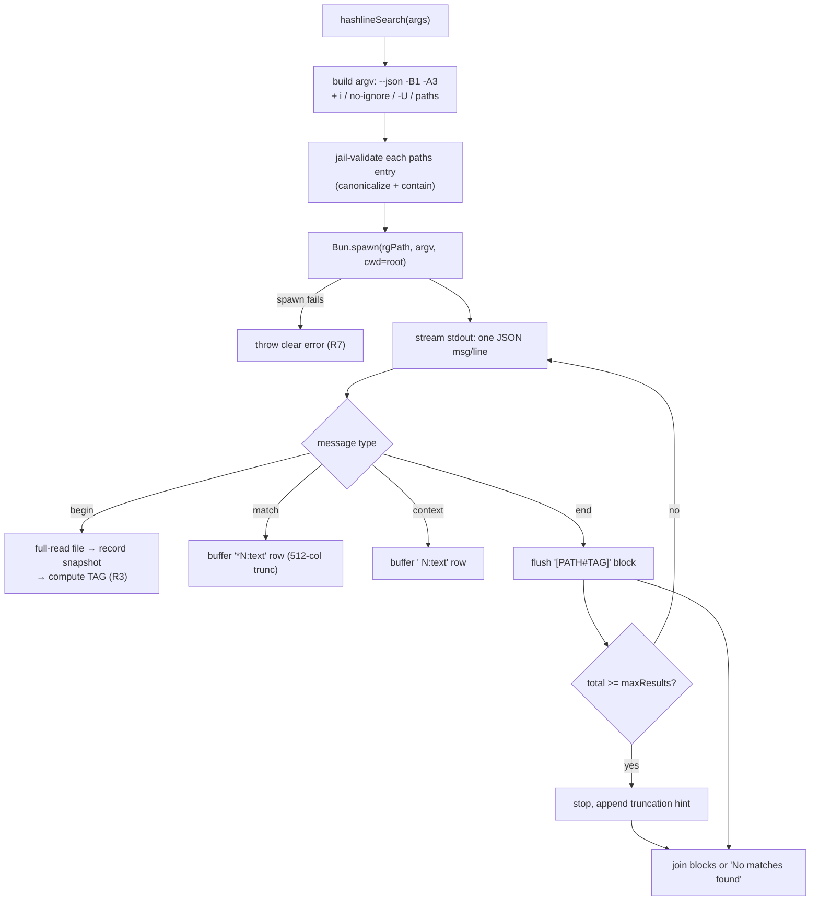

# feat: Adopt ripgrep as the search engine

**Origin:** `docs/brainstorms/2026-06-14-search-ripgrep-engine-requirements.md`
**Type:** feat (engine swap + new args) · **Depth:** Standard

## Summary

Replace the `search` tool's hand-rolled file walker + JavaScript `new RegExp` scan with ripgrep, spawned as a subprocess via `@vscode/ripgrep` and consumed through its `--json` message stream. The swap is value-neutral on the output contract — the `[PATH#TAG]` header, `*`/space match-vs-context rows, 1-before/3-after window, and 512-column truncation are all preserved — but it eliminates the ReDoS class (linear-time RE2 engine), honors nested `.gitignore` for free, and unlocks `paths` scoping and `multiline` matching. The hand-rolled walker, `mergeWindows`, `loadGitignore`, and the `ignore` npm dependency are deleted. Spawn failure is a hard error with no fallback path.

---

## Problem Frame

`hashlineSearch` (`src/core.ts`) walks the tree itself and runs `new RegExp(args.pattern)` per line. That choice carries three defects: model-supplied patterns can catastrophically backtrack and hang the MCP call (self-DoS); only the repo-root `.gitignore` is honored; and there is no `paths` scoping or multiline support. The published `@oh-my-pi/hashline` package ships no search module, so our search was always a behavioral reimplementation of the oh-my-pi *harness* — which shells out to ripgrep. Adopting ripgrep is both the faithful upstream match and the single change that closes all three defects.

---

## Requirements Traceability

- **R1** engine swap to `@vscode/ripgrep` via `--json` → U1, U3
- **R2** preserve output contract verbatim → U3
- **R3** preserve match-gated whole-file snapshot + TAG → U3
- **R4** `i`/`gitignore`/`maxResults` → flags → U2, U3
- **R5** add `paths` arg, jail-validated → U2, U5
- **R6** add `multiline` arg → U2, U5
- **R7** hard-error on spawn failure, no fallback → U1, U4
- **R8** all targets inside the workspace jail, no symlink escape → U2

---

## High-Level Technical Design

Directional guidance, not implementation spec. The pipeline replaces the in-process walk+match with a streamed ripgrep transaction; snapshot recording moves to the per-file `begin` message so only matched files are read.

ripgrep emits `match`/`context` already windowed and overlap-merged by `-B1 -A3`, so no client-side window merging is needed.

---

## Key Technical Decisions

- **KTD1 — `@vscode/ripgrep` (bundled binary), spawned via `Bun.spawn`.** v1.18.0 ships prebuilt per-platform binaries as optional deps (no postinstall download). Exposes `rgPath`. Follow the existing spawn pattern at `bench/runner.ts:139`. This *reverses* the prior "stay in-process, don't shell out" learning (see U6) — justified because bundled binaries remove the missing-binary risk that motivated the original decision, and the user authorized new deps.
- **KTD2 — Consume `--json`, not text.** Verified-live message shape: `begin.data.path.text`, `match.data.line_number` + `data.lines.text` + `data.submatches[]`, `context.data.line_number` + `data.lines.text`, `end`. Maps 1:1 onto the per-file block model and is ripgrep's recommended integration format.
- **KTD3 — Snapshot on `begin`.** Recording moves to the `begin` message so each matched file is full-read exactly once to record its snapshot and compute its TAG. Unmatched files are never read (match-gating preserved). This keeps edit-without-read intact.
- **KTD4 — RE2 dialect is the contract.** Patterns are Rust `regex` syntax (no backreferences/lookbehind). Documented in the tool description (U5). Benchmark anchors are plain identifiers, so the suite is unaffected.
- **KTD5 — No fallback.** The JS walker is deleted, not retained behind a flag. Spawn failure throws a clear, actionable message.

---

## Implementation Units

### U1. ripgrep spawn + JSON stream helper

- **Goal:** A thin module that resolves `rgPath`, spawns ripgrep with a given argv and cwd, streams stdout as line-delimited JSON, and yields typed messages. Hard-errors with a clear message on spawn failure. (R1, R7; KTD1, KTD2)
- **Dependencies:** none
- **Files:** `package.json` (+`@vscode/ripgrep`), `bun.lock`, `src/ripgrep.ts` (new), `test/ripgrep.test.ts` (new)
- **Approach:** Export `RipgrepMessage` union types (begin/match/context/end). `runRipgrep({ argv, cwd })` uses `Bun.spawn` (pattern: `bench/runner.ts:139`), reads stdout, splits on `\n`, `JSON.parse` per non-empty line, yields messages. Distinguish "rg not spawnable" (throw) from "rg ran, zero matches" (exit code 1, normal). Stream rather than buffering the whole output.
- **Patterns to follow:** `Bun.spawn` usage in `bench/runner.ts:139` and `test/hook.test.ts:10`.
- **Test scenarios:**
  - Happy path: a fixture with two matching files yields begin/match/context/end messages in file order with correct `line_number` and `text`.
  - Zero matches: rg exit code 1 yields an empty message stream and does NOT throw.
  - Spawn failure (bogus binary path) throws an error whose message names ripgrep and is actionable.
  - A line of malformed/non-JSON stdout is skipped without crashing the stream.

### U2. Argv builder + `paths` jail validation

- **Goal:** Build the ripgrep argv from search args and validate `paths` against the workspace jail before spawning. (R4, R5, R6, R8)
- **Dependencies:** U1
- **Files:** `src/ripgrep.ts` or `src/core.ts`, `test/core.test.ts`
- **Approach:** Always include `--json -B1 -A3`. Add `-i` when `i`; `--no-ignore` when `gitignore === false` (default-on respects nested `.gitignore`); `-U` when `multiline`; append each `paths` entry as a positional arg. Run rg with `cwd = ctx.root`; do not pass a follow-symlinks flag. For each `paths` entry call `ctx.fs.canonicalPath` and reject (throw `PathEscapeError`) anything that escapes the jail, before spawning.
- **Patterns to follow:** jail use in `hashlineRead`/`hashlineEdit` (`ctx.fs.canonicalPath`).
- **Test scenarios:**
  - `i:true` adds `-i`; omitted adds neither.
  - `gitignore:false` adds `--no-ignore`; default omits it.
  - `multiline:true` adds `-U`.
  - `paths:["src","bench"]` appends both as positional args.
  - A `paths` entry resolving outside the jail (`../escape`, absolute outside root, or symlink target outside) throws `PathEscapeError` and rg is never spawned.
  - Covers R8 / jail containment.

### U3. Rewrite `hashlineSearch` to consume rg JSON + record snapshots

- **Goal:** Replace the walk+match body of `hashlineSearch` with consumption of `runRipgrep`, recording a whole-file snapshot on each `begin` and rendering the existing block format. (R1, R2, R3; KTD3)
- **Dependencies:** U1, U2
- **Files:** `src/core.ts`, `test/core.test.ts`
- **Approach:** On `begin`, full-read the file via `ctx.fs.readText`, normalize, `ctx.snapshots.record(canonicalPath, normalized)`, compute the header via `formatHashlineHeader`. Buffer `match` rows as `*N:text` and `context` rows as ` N:text` through the existing `formatMatchLine` (512-col truncation retained). On `end`, flush the `[PATH#TAG]` block. Track total emitted match rows; once `>= maxResults` (default 50), stop consuming and append the truncation hint. Return `No matches found` when no blocks. Delete `mergeWindows` usage (ripgrep windows the output).
- **Patterns to follow:** snapshot+header recording in `hashlineRead` (`src/core.ts:79-90`); existing `formatMatchLine`.
- **Test scenarios:**
  - Output for a known query byte-matches the pre-swap format (header, `*`/space markers, window, ordering).
  - **Edit-without-read invariant (load-bearing):** `edit` anchored on a `[PATH#TAG]` returned by `search`, with no prior `read`, succeeds. Covers R3.
  - Only matched files get snapshots recorded; an unmatched sibling file has no snapshot entry.
  - `maxResults` cap: a query with many hits stops at the cap and appends the truncation hint; a window is rendered atomically (cap is a floor).
  - No matches returns exactly `No matches found`.
  - A match line longer than 512 columns is truncated with a trailing `…`.

### U4. Remove the JS walker, `mergeWindows`, `loadGitignore`, and the `ignore` dep

- **Goal:** Delete the superseded in-process search machinery and the now-unused dependency. (R1, R7; KTD5)
- **Dependencies:** U3
- **Files:** `src/core.ts`, `package.json`, `bun.lock`
- **Approach:** Remove `walkFiles`, `mergeWindows`, `loadGitignore`, `SEARCH_SKIP_DIRS`, `MAX_SEARCH_FILE_BYTES`, and the `import ignore` + `readFileSync`/`readdirSync`/`statSync` imports that only search used (keep any still used by `hashlineRead`). Drop `ignore` from `package.json` dependencies. Confirm no other module imports the removed symbols.
- **Patterns to follow:** n/a (deletion). Remove only orphaned imports.
- **Test scenarios:** Test expectation: none — pure removal; covered by U1–U3 suites and `tsc --noEmit` (no dangling references) and the benchmark (U7).

### U5. Update tool description + search schema for dialect, `paths`, `multiline`

- **Goal:** Document the RE2 dialect and expose the two new args in the MCP schema and steering description. (R5, R6; KTD4)
- **Dependencies:** U3
- **Files:** `src/descriptions.ts`, `src/server.ts`, `test/core.test.ts` (if description is asserted)
- **Approach:** In `SEARCH_TOOL_DESCRIPTION`, state that `pattern` is Rust/RE2 regex syntax (no backreferences/lookbehind) and document `paths` (scope to subpaths) and `multiline`. In `server.ts` search `inputSchema`, add `paths: z.array(z.string()).optional()` and `multiline: z.boolean().optional()` with descriptions, and thread them into the `hashlineSearch` call.
- **Patterns to follow:** existing arg wiring for `i`/`gitignore`/`maxResults` in `src/server.ts:42-51`.
- **Test scenarios:**
  - Schema accepts `paths` and `multiline` and forwards them to `hashlineSearch`.
  - Description text names the RE2 dialect and both new args (light assertion if descriptions are tested).

### U6. Correct the superseded solution doc

- **Goal:** Update `snapshot-producing-search-tool.md` Decision #4 so the institutional learning matches the shipped code. (Origin call-out)
- **Dependencies:** U3
- **Files:** `docs/solutions/architecture-patterns/snapshot-producing-search-tool.md`
- **Approach:** Revise Decision #4 ("Stay in-process; don't shell out") to record that the plugin now shells out to bundled ripgrep (`@vscode/ripgrep`), why the original missing-binary concern is mitigated (binaries ship as optional deps), and that the in-process walk was replaced. Keep decisions #1–#3 (snapshot producer, format mirroring, model-facing conventions) — they still hold. Resolve the text in place; do not stack a contradiction.
- **Test scenarios:** Test expectation: none — documentation.

### U7. Re-benchmark for no-regression

- **Goal:** Prove the engine swap holds pass-rate and still exercises search. (Success criteria)
- **Dependencies:** U1, U2, U3, U4, U5
- **Files:** `report*.md` (generated), no source change
- **Approach:** Run the search-mode benchmark (`--search`) across the existing fixtures/models. Confirm no pass-rate regression vs. the prior search-mode report and `search/task` > 0 for the hashline arm. Spot-check a known catastrophic-backtracking pattern completes promptly (no hang) as a manual ReDoS check.
- **Execution note:** Verification unit — run after U1–U5 land; treat a pass-rate drop as a blocker, not a doc update.
- **Test scenarios:** Test expectation: none — this unit *is* the verification gate.

---

## Scope Boundaries

- **In scope:** the engine swap; `paths` + `multiline` args; nested-`.gitignore` (free); ReDoS elimination (free); dialect doc; solution-doc correction; benchmark re-run.
- **Deferred to Follow-Up Work:** column-accurate highlighting via `submatches[]` offsets; exposing further ripgrep flags (file-type filters, `--hidden`, glob includes/excludes).
- **Non-goals:** changing the edit/read/snapshot core; changing the output format; the per-line-hash harness variant.

---

## Risks & Dependencies

- **New runtime dep `@vscode/ripgrep`.** Mitigated: bundled per-platform binaries, no network at install; relaxation of "prefer existing deps" explicitly authorized.
- **Dialect incompatibility.** A pattern using JS-only regex features (backreferences, lookbehind) errors under RE2. Mitigated by documenting the dialect (U5); benchmark uses plain anchors.
- **JSON stream edge cases.** Very large match volumes or huge lines — mitigated by the `maxResults` cap (stop consuming) and 512-col truncation.
- **Bun subprocess parity.** `Bun.spawn` already used in-repo (`bench/runner.ts:139`), so the spawn path is proven.

---

## Success Criteria

- Same output format as today for the same query/corpus (modulo dialect-incompatible patterns).
- Search-mode benchmark: no pass-rate regression, `search/task` > 0 for the hashline arm.
- A catastrophic-backtracking pattern completes promptly instead of hanging.
- Nested `.gitignore`, `paths`, and `multiline` each work as specified.
- Spawn failure produces a clear error, not a hang or silent empty result.
- `tsc --noEmit` and `bun test` pass; no dangling references to removed symbols.
