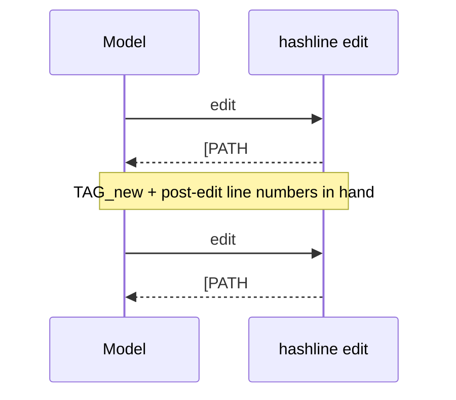

# feat: Post-edit tagged window for chained edits (diff-preview)

## Summary

The hashline `edit` tool currently returns only `[PATH#TAG] (update)` after an edit. The model has the new tag but **no view of the post-edit line numbers**, so to make a second edit in the same file it re-`read`s — a wasted turn and tokens on every multi-edit sequence. This plan makes `edit` return a **re-anchored, numbered window** of the post-edit content (the same shape `read` produces) so the model can chain follow-up edits with no intervening read. It also adds a **multi-edit benchmark fixture type** (today's corpus is single-mutation only, so the re-read tax is invisible) and validates the change through the optimize-loop, where it should register as a **token tie-break KEEP**.

## Problem Frame

- **Who:** the model editing through hashline (esp. on multi-step changes in one file).
- **Pain:** every hashline edit invalidates the file's content-hash tag and shifts line numbers. The model can't safely reference post-edit lines from memory, so it re-reads. The `read` description even instructs "Re-read after any edit to get a fresh TAG."
- **Why now:** the enabling data already exists. `PatcherApplyResult` per-section carries `after`, `fileHash`, `header` (`[path#tag]`), and `firstChangedLine`, and `Patcher.commit` **already records the post-edit snapshot** (`node_modules/@oh-my-pi/hashline/src/patcher.ts:312`). So chaining is already *permitted* by the read-before-edit gate (snapshot head is non-null post-edit) — it's just not *ergonomic* because no numbered view comes back. This is a response-formatting change, not new edit machinery.
- **Goal:** eliminate the re-read round-trip on chained edits; measure the token/turn savings.

## Requirements

- R1 — After a successful edit, the response includes, per changed section, the post-edit `[PATH#TAG]` header followed by a numbered window of the post-edit content around the change.
- R2 — The returned view is sufficient to chain a follow-up edit with **no intervening `read`** (correct tag + correct absolute post-edit line numbers).
- R3 — Window is bounded: a few context lines around `firstChangedLine`; large/multi-hunk changes are elided compactly, not echoed in full.
- R4 — Multi-section edits return one tagged window per changed section; noop sections still return their tag so they remain chainable.
- R5 — Tool descriptions tell the model the edit response is chainable and remove the unconditional "re-read after any edit" instruction.
- R6 — A benchmark fixture type exists that requires 2+ sequential edits in one file, so the optimize-loop can measure the re-read savings.
- R7 — Behavior is validated paired through the optimize-loop (expected KEEP via the token tie-break: edit-fails flat, tokens down, pass not regressed).

## Scope Boundaries

- In scope: edit-response formatting, description updates, multi-edit fixtures, loop validation.
- Out of scope (separate oh-my-pi explorations): block/structural edits (`block.ts`, out of v1 — needs a tree-sitter resolver), stale-tag recovery surfacing (`recovery.ts`), streaming reads (`stream.ts`).

### Deferred to Follow-Up Work

- An explicit `reReads`/`readCalls` metric in the scorer (tokens/turns already capture the savings for the tie-break; add only if signal is ambiguous).
- An opt-in/quiet flag to suppress the window (only if always-on proves token-negative on single edits — see Open Questions).

---

## Key Technical Decisions

- **KTD1 — Re-anchored tagged window is the enabler, not a bare diff.** The blocker to chaining is the stale tag + unknown post-edit line numbers. Both are solved by re-emitting a `read`-equivalent view from `PatchSectionResult.header` + a `formatNumberedLines` window of `after`. `buildCompactDiffPreview` alone provides neither an anchorable tag nor absolute line numbers, so it cannot stand in for this. (It may *augment* the view for large changes — see KTD3.)
- **KTD2 — Always-on, no opt-in flag.** The new tag is already returned today; the marginal cost is a small numbered window. Most edits are single-site → the window is a few lines. An opt-in flag is a knob the model must learn for little benefit. Recorded as the default; revisit only if the loop shows a single-edit token regression (Open Questions).
- **KTD3 — Window = context lines around `firstChangedLine` of `after`, capped.** N context lines (e.g. 3) on each side of `firstChangedLine`, numbered with absolute post-edit line numbers via `formatNumberedLines`. `PatchSectionResult` exposes no *last*-changed-line, so the window anchors at `firstChangedLine` only; for a multi-line delete or multi-hunk edit it may not bracket the change's far edge — acceptable for v1 (the model still has the correct tag and can re-read for lines outside the window). Cap an over-long window with a plain `... N more lines ...` marker (simple string logic), **not** `buildCompactDiffPreview` — that consumes a `<sign><lineNum>|content` unified diff the patcher does not surface to the adapter, and no benchmark fixture is large enough to need it (see Open Questions). Window size is a tunable the loop can sweep.
- **KTD4 — One window per changed section; noops still return their tag (single-section only).** Mirrors the existing per-section response loop in `hashlineEdit`. Constraint: `Patcher.apply` throws if any section in a *multi*-section batch is a noop (`node_modules/@oh-my-pi/hashline/src/patcher.ts:195-199`); a noop result is only returned on the single-section fast path. So R4's noop-tag behavior is reachable only for single-section edits — do not assert a noop window inside a batch.
- **KTD5 — Loop signal is the token tie-break, not edit-fails.** Diff-preview reduces re-reads (tokens/turns), not rejections. `bench/paired.ts` already keeps on `editFailTied && meanTokenDelta < 0`. No skill change needed (unlike the colon-range cycle). Measured on multi-edit fixtures where re-reads actually occur.
- **KTD6 — Multi-edit fixtures = two independent single-site mutations in one file.** The task names both; scoring requires both fixed (final == expected). Tracked as a benchmark-realism change (extends `bench/mutate.ts`/`bench/generate.ts`), like the comment-mutation fix.

---

## High-Level Technical Design

**Response shape change** (per changed section):

```
before:  [src/app.ts#7F2A] (update)

after:   [src/app.ts#7F2A] (update)
         3:export function hello() {
         4:  return "hashline";
         5:}
         (window around the changed lines, absolute post-edit numbers)
```

**Chained-edit flow — the re-read this removes:**



The snapshot for `TAG_new` is already recorded by `Patcher.commit`, so edit #2 passes the read-before-edit gate without a `read`. Directional; prose is authoritative.

---

## Implementation Units

### U1. Return a re-anchored numbered window from the edit path

- **Goal:** R1–R4 — after a successful apply, emit per changed section the post-edit `[PATH#TAG]` + a bounded numbered window around the change.
- **Requirements:** R1, R2, R3, R4.
- **Dependencies:** none.
- **Files:** `src/core.ts` (the `hashlineEdit` success branch that maps `result.sections`), `test/core.test.ts`.
- **Approach:** Replace the `${s.header} (${s.op})` mapping with: header line + a numbered window built from `s.after` around `s.firstChangedLine` using the package's `formatNumberedLines` (already imported) with the correct start line. Bound the window to ±N context lines; cap an over-long window with a plain `... N more lines ...` marker (not `buildCompactDiffPreview` — see KTD3). **Guard `s.firstChangedLine` being absent** — the noop branch omits it (`patcher.ts:296-307`); fall through to the existing noop response without computing a window (avoid a `NaN`-anchored slice). noop sections keep a "no change" line but still surface `s.header`. Reuse the windowing math already present in `hashlineRead` (offset/limit slice) so read and edit windows render identically.
- **Patterns to follow:** `hashlineRead` window/slice + `formatHashlineHeader`/`formatNumberedLines` usage in `src/core.ts`; the existing per-section map in `hashlineEdit`.
- **Execution note:** implement the chaining contract test-first (U4's chained-edit test is the spec).
- **Test scenarios:**
  - Single replace → response contains `[path#NEWTAG]` and the changed line with its post-edit number.
  - Insert that shifts lines → window shows correct shifted absolute numbers below the insert.
  - Delete-only edit → window shows the surrounding lines at post-edit numbers; no dangling reference to the removed line.
  - Large multi-line insert → window is truncated with a `... N more lines ...` marker (does not echo every added line), still shows the tag.
  - Multi-section edit (two files) → one tagged window per file.
  - noop edit → "no change" plus the tag; no spurious window.
  - Verification: response parses as a valid hashline view (`[PATH#TAG]` + `LINE:TEXT` rows).

### U2. Update tool descriptions for chaining

- **Goal:** R5 — teach the model the edit response is chainable; stop the unconditional re-read.
- **Requirements:** R5.
- **Dependencies:** U1.
- **Files:** `src/descriptions.ts`, `test/core.test.ts` (if any description text is asserted) or `test/bench.test.ts`.
- **Approach:** In `EDIT_TOOL_DESCRIPTION`, state that a successful edit returns the new `[PATH#TAG]` and a numbered window, and that the model may issue a follow-up edit directly off that view without re-reading. In `READ_TOOL_DESCRIPTION`, soften "Re-read after any edit to get a fresh TAG" to "the edit response already returns the fresh tagged view; re-read only when you need lines outside the returned window." Keep wording tight — description tokens are paid on every call.
- **Patterns to follow:** existing description prose and the `read`/`edit` examples in `src/descriptions.ts`.
- **Test scenarios:** Test expectation: none for prose itself; if a description invariant is asserted elsewhere, update that assertion. The behavioral contract is covered by U1/U4.

### U3. Multi-edit benchmark fixtures

- **Goal:** R6 — generate fixtures requiring 2+ sequential edits in one file.
- **Requirements:** R6.
- **Dependencies:** none (parallel to U1/U2).
- **Files:** `bench/mutate.ts`, `bench/generate.ts`, `test/bench.test.ts`.
- **Approach:** Add a multi-site mutation that applies two independent single-site bugs **into one file copy** (reuse the existing `RULES`, pick two non-overlapping mutatable lines; do not concatenate two `buggy` strings — each `Mutation.buggy` is already a full-file copy). Emit a fixture whose `task.md` names both bug sites ("fix the bugs near lines X and Y") and whose `.expected` is the clean original. Wiring requires: (a) add `"multi-edit"` to the `Difficulty` union (`bench/mutate.ts:11`), (b) extend the difficulty-coverage picker in `bench/generate.ts` (~line 71), and (c) update the stratifier assertion in `test/bench.test.ts` (~lines 81-96). `meta.json` carries a single `line`; set it to the first site and **scope multi-edit fixtures to the hashline arm only (not search-mode)** — `run.ts` feeds `meta.line` to `computeAnchor`/the search-prompt rewrite (`bench/run.ts:117,124`), which assumes one anchor. Honor the comment/string masking and stale-dir clearing already in `generate.ts`. This is a **benchmark-realism** change, tracked separately from the harness trajectory in the ledger.
- **Patterns to follow:** `mutationsFor` single-site loop and the difficulty tagging in `bench/mutate.ts`; fixture emission in `bench/generate.ts`.
- **Test scenarios:**
  - A source with ≥2 mutatable lines yields a multi-edit fixture with two distinct changed lines vs the original.
  - The fixture's `.expected` equals the unmutated source.
  - The two mutated sites are on different lines (no overlap).
  - Comment/string lines are still never chosen (regression guard already in place).

### U4. Tests for the chaining contract

- **Goal:** R2 — prove a follow-up edit applies off the returned view with no intervening read.
- **Requirements:** R1, R2.
- **Dependencies:** U1.
- **Files:** `test/core.test.ts`.
- **Approach:** Read a file once, edit it, then issue a second edit using ONLY the `[PATH#TAG]` and line numbers from the first edit's response (no second `read`); assert it applies (not an error) and the final content is correct. Add an assertion that the returned window's tag matches a fresh hash of the post-edit content.
- **Patterns to follow:** `tagFrom` helper + edit assertions in `test/core.test.ts`.
- **Execution note:** test-first — write this before/with U1.
- **Test scenarios:**
  - Edit → chained edit off the response tag/numbers → applies, final content correct (happy path for R2).
  - Chained edit using a STALE (pre-edit) tag → still rejected/recovered (we did not weaken the gate).
  - The window's tag equals `computeFileHash(after)` (re-anchor correctness).
  - Two sequential inserts → second edit references correctly shifted numbers from the first response.

### U5. Optimize-loop validation

- **Goal:** R7 — validate paired; confirm a token win without pass/edit-fail regression.
- **Requirements:** R7.
- **Dependencies:** U1, U2, U3.
- **Files:** `docs/benchmark/LEDGER.md` (trajectory + cost); generated reports/records under `docs/benchmark/iters/` (gitignored).
- **Approach:** Per `.claude/skills/optimize-loop`: generate a dev set including multi-edit fixtures; measure baseline (current HEAD) and candidate (U1+U2) back-to-back on sonnet+haiku, hashline arm. Run `bench/paired.ts` — expect KEEP via the token tie-break (edit-fails flat, tokens/task down, pass within margin). Apply the holdout "did it fire?" guard: only a holdout that actually contains multi-edit tasks can confirm/veto. Cap 2 cycles (one clear hypothesis; window-size is the only tunable). Record cost.
- **Patterns to follow:** the cycle-1 trajectory and ledger format already in `docs/benchmark/LEDGER.md`; `bench/run.ts` + `bench/paired.ts` invocation.
- **Test scenarios:** Test expectation: none (validation activity, not shipped code). Gate: `bun run typecheck && bun test` green before each measurement.

---

## Risks & Mitigations

- **Always-on window adds tokens to single edits** → could net-regress the token tie-break if single edits dominate. Mitigation: small window + elision (KTD3); the loop measures single + multi together and the keep rule blocks a net token regression. If it regresses, fall back to the opt-in flag (Open Questions).
- **Line-number mis-trust after shifts** → if the window's numbers are wrong post-insert/delete, chained edits raise edit-fails. Mitigation: numbers come straight from `after` via `formatNumberedLines`; U4 asserts a chained edit applies and the tag matches `computeFileHash(after)`.
- **Loop sees no signal if multi-edit fixtures are too easy** (model one-shots both edits in one patch instead of sequentially). Mitigation: task wording and two distant sites encourage sequential edits; if the model batches, that's itself a no-regression outcome — note it in the ledger rather than forcing the metric.

## Open Questions

- Opt-in/quiet flag for the window — defer unless the loop shows a single-edit token regression (KTD2).
- Explicit `reReads` metric vs relying on tokens/turns — defer (Deferred to Follow-Up Work).
- Exact context-window size and the large-change truncation threshold — tune in U5's loop.
- `buildCompactDiffPreview`-based elision (vs the plain `... N more lines ...` marker) — deferred until a fixture actually produces a large multi-hunk window; it needs a `<sign><lineNum>|content` diff the patcher doesn't currently surface to the adapter.

## Sources & Research

- `node_modules/@oh-my-pi/hashline/src/patcher.ts` — `PatchSectionResult` fields (`after`, `fileHash`, `header`, `firstChangedLine`); `commit` records post-edit snapshot (line 312).
- `node_modules/@oh-my-pi/hashline/src/diff-preview.ts` — `buildCompactDiffPreview` (compact elided preview for large changes).
- `node_modules/@oh-my-pi/hashline/src/format.ts` — `formatNumberedLines`/`formatHashlineHeader` (the read-view renderer reused here).
- `src/core.ts` — current `hashlineEdit` response loop and `hashlineRead` windowing; `docs/benchmark/LEDGER.md` — loop method + holdout guard.
- External research: not run — internal package API, verified by reading source; local patterns strong.
